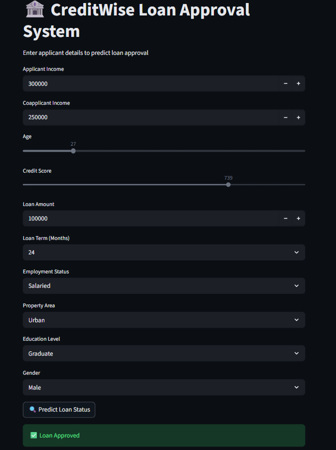

# 🏦 CreditWise Loan Approval System

_Predicting loan approval decisions using Machine Learning to enable faster, unbiased, and data-driven financial decision-making._

---

## 📌 Table of Contents
- <a href="#overview">Overview</a>
- <a href="#Live Application">Live Application</a>
- <a href="#Application Preview">Application preview</a>
- <a href="#business-problem">Business Problem</a>
- <a href="#dataset">Dataset</a>
- <a href="#machine-learning-approach">Machine Learning Approach</a>
- <a href="#tools--technologies">Tools & Technologies</a>
- <a href="#project-structure">Project Structure</a>
- <a href="#application-features">Application Features</a>
- <a href="#deployment">Deployment</a>
- <a href="#author">Author</a>

---

<h2>Overview</h2>

This project implements an end-to-end **Machine Learning Loan Approval System** that predicts whether a loan application should be approved or rejected based on applicant financial and demographic information.

The system integrates a trained classification model with a **Streamlit-based web application**, allowing real-time predictions through a clean and professional user interface.

---

<h2></h2>

## 🚀 Live Application

🔗 https://creditwise-loan-approval-htjfef6ccughuoyswbe7gu.streamlit.app/

---

<h2></h2>

## 🖼 Application Preview

---

<h2>Business Problem</h2>

Traditional loan approval processes depend heavily on manual document verification and human judgment, which leads to:

- Delays in loan processing  
- Inconsistent decision-making  
- Potential bias in approvals  
- Higher operational costs  

The objective of this project is to automate the initial loan approval decision using historical data and machine learning, enabling faster, fairer, and more reliable evaluations.

---

<h2>Dataset</h2>

Each record in the dataset represents a loan applicant with attributes describing personal, financial, and credit information.

**Key Features:**
- Applicant Income  
- Coapplicant Income  
- Age  
- Credit Score  
- Loan Amount  
- Loan Term  
- Employment Status  
- Education Level  
- Property Area  
- Gender  

**Target Variable:**
- `Loan_Approved`  
  - `1` → Approved  
  - `0` → Rejected  

The dataset is used for training and evaluating the machine learning model.

---

<h2>Machine Learning Approach</h2>

- **Problem Type:** Binary Classification  
- **Model Used:** Logistic Regression  
- **Preprocessing Steps:**
  - One-Hot Encoding for categorical variables  
  - Feature Scaling using StandardScaler  
- **Model Serialization:** Pickle  

Logistic Regression was selected due to its interpretability and effectiveness in financial risk assessment problems.

---

<h2>Tools & Technologies</h2>

- **Python** – Core programming language  
- **Scikit-learn** – Model training and preprocessing  
- **Pandas & NumPy** – Data manipulation and numerical analysis 
- **Matplotlib & Seaborn** -Data Visualization
- **Streamlit** – Web application framework  
- **Pickle** – Model serialization  
- **Git & GitHub** – Version control and collaboration  
- **Streamlit Cloud** – Application deployment  

---

<h2>Project Structure</h2>

creditwise-loan-approval/
│
├── app.py                  # Streamlit web application
├── train_model.py          # Model training script
├── requirements.txt        # Python dependencies
├── README.md               # Project documentation
│
├── model/
│   ├── loan_model.pkl      # Trained ML model
│   ├── scaler.pkl          # Feature scaler
│   └── features.pkl        # Feature names used during training
│
├── data/
│   └── loan_approval_data.csv
│
└── .streamlit/
    └── config.toml         # Dark theme configuration

---

<h2>Application Features</h2>

- Real-time loan approval prediction  
- Probability-based decision output  
- Dark-themed professional UI  
- User-friendly input controls  
- Deployed and publicly accessible web application  

---
<h2>Deployment</h2>

The application is deployed using Streamlit Cloud, enabling public access to the machine learning model through a web interface.

Repository is connected directly to Streamlit Cloud

app.py is configured as the main entry point

Model artifacts are loaded at runtime for inference

🔗 Live Application:
https://creditwise-loan-approval-htjfef6ccughuoyswbe7gu.streamlit.app/

<h2>Author</h2>

## Author

**Ravi Aghara** 
📧 Email: [aaghararavi@gmail.com](mailto:aaghararavi@gmail.com)  
🐙 GitHub: https://github.com/raviaghara007  
🔗 LinkedIn: https://www.linkedin.com/in/raviaghara07/

